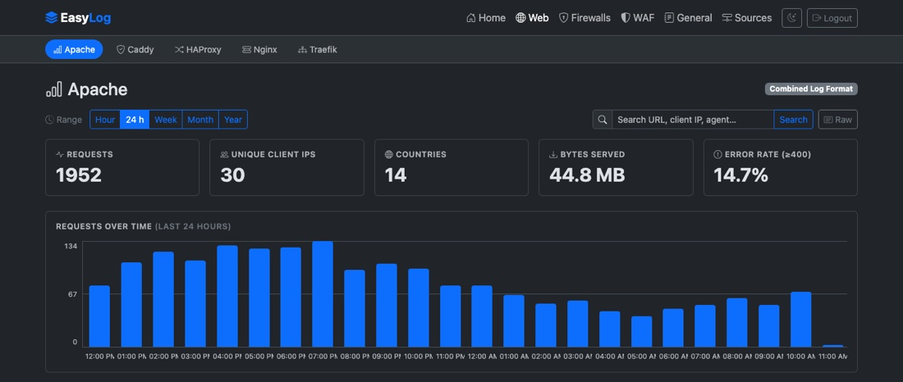

# Dashboards

<figure markdown="span">
  { loading=lazy }
  <figcaption>A web dashboard: the category and vendor navigation, KPI cards, and requests over time.</figcaption>
</figure>

Each log type has its own dashboard, and the home page rolls everything up:

*   **KPI cards** — requests, unique client IPs, bytes served, error rate (and avg/p95 duration for Traefik).
*   **Requests over time** — a zero-filled timeline that spans the whole selected range, shown in **your browser's local timezone**. Every bar is clickable: see [Zooming into a period](#zooming-into-a-period).
*   **Status codes** — 2xx / 3xx / 4xx / 5xx breakdown; click a class to filter.
*   **Top URLs & client IPs** (and **routers / services** for Traefik) — click any row to filter the whole dashboard. Filters stack and are shareable by URL.
*   **Requests by country** — a **Top countries** panel and a world map shaded by request volume; hover a country for its exact count, click it to filter.

Use the time-range buttons (**Hour · 24h · Week · Month · Year**) to bound everything, and click chart elements — including the timeline's bars — to drill in — the URL captures the active filters, so views are bookmarkable.

## Zooming into a period

Spotted a spike at 2am? **Click the bar.** The whole dashboard — KPIs, charts, panels, world map, and the raw view behind it — is pinned to that period, 02:00 to 03:00, and the timeline re-buckets *inside* the hour into five-minute bars. Click one of those and you are down to five minutes; keep going and you reach a minute. It is the fastest way from "something happened around then" to the handful of lines that caused it.

The pinned period appears as a removable chip (in your local timezone, like the timeline labels), stacks with search and every drill-down filter, and lives in the URL as `?from=&to=` epoch seconds — so a zoomed-in view is as shareable as any other. Removing the chip, or picking a time range, returns to the plain range.

## From charts to the actual lines

Every dashboard has a **Raw** button. It replaces the charts with the log lines behind them — newest first — and the **Dashboard** button switches back. It's a mode of the dashboard rather than a separate page, so the time range, every drill-down filter and the search term still apply: narrow to what you're investigating, hit Raw, and you're looking at exactly those events as the device sent them. The URL carries `view=raw`, so that stays shareable too.

Lines load 200 at a time with **Load more**, and **Download** saves every line matching the current filters as a `.log` file — handy for handing evidence to someone or grepping offline. Large exports are read in batches so they never stall ingestion, and stop at 500,000 lines (the file says so if it gets there).

## Searching

Every dashboard has a **search box** beside the range selector. It matches free text across the fields that type records — URL, client IP, user agent and host on the web dashboards (plus routers/services or backends/servers), and source, destination, port, rule, application, zone and protocol on the firewalls.

Matching is case-insensitive substring, so `203.0.113` finds a whole subnet, `/admin` finds every path containing it, and `443` finds traffic to that port. Search behaves like any other filter: it narrows the KPIs, the timeline, every panel and the world map together, stacks with whatever drill-down is already active, appears as a removable chip, and is part of the URL — so a search is as shareable as any other view.

Dashboards are grouped by **category** in the navigation: the top row picks a category — **Web**, **Firewalls**, **WAF**, **General**, with **3rd parties** appearing as those log types land — and the row beneath it lists that category's dashboards. Each dashboard lives under its category, e.g. `/web/apache` or `/waf/easywaf`; the older flat paths such as `/apache` redirect there, so existing bookmarks keep working.

## The WAF dashboard

EasyWAF's dashboard asks a different question from the firewall ones. A firewall dashboard splits traffic two ways — allowed or denied. A WAF has six verdicts, and the interesting ones are not the blocks:

*   `blocked` — refused, the attack stopped.
*   `would_block` / `would_challenge` — **served**, because the policy is in DetectionOnly. An enforcing policy would have refused them.
*   `scored` — served because the rules that matched didn't reach the block threshold. This is where reconnaissance shows up.
*   `challenged`, `passed` — a CAPTCHA was shown, or nothing matched at all.

<figure markdown="span">
  { loading=lazy }
  <figcaption>The EasyWAF dashboard during an attack burst: blocked at the foot of each bar, and the Served anyway card beside the block rate.</figcaption>
</figure>

So the dashboard leads with a **Served anyway** card counting `would_block` + `would_challenge` — on a DetectionOnly policy that is the number that justifies enforcing — and stacks all six verdicts on the timeline, worst at the foot of each bar. Below it, **By appliance and site** repeats the split for every EasyWAF sending in, which is the view a single appliance cannot produce and the main reason to ship the logs at all. **Top rules fired** unnests the rule list, so a rule dominating `scored` against ordinary traffic stands out as a tuning candidate, while one dominating `blocked` is doing its job. Everything filters, and filters stack: rule 942100 + verdict `scored` + last hour is three clicks.

## Where your traffic comes from

Each client IP is resolved to a country as the log line is ingested, so every dashboard — and the home overview — can show traffic geographically.

<figure markdown="span">
  { loading=lazy }
  <figcaption>Requests by country, shaded over five steps. Clicking a country filters the whole dashboard to its traffic.</figcaption>
</figure>

The shading uses a **logarithmic scale**, so a single dominant country doesn't flatten everything else into one shade. Clients that can't be placed on the map — private-network addresses (`10.0.0.0/8`, `192.168.0.0/16`, …) and unresolved IPs — are never silently dropped: they're counted under the map and listed in the Top-countries panel as *Private network* and *Unknown*.

The map composes with everything else on the page: pick a range, click a status class, then click a country, and the KPIs, timeline, and tables all follow. Country filters appear as removable chips like any other filter.

!!! note "Lookups are offline, and swappable"
    EasyLog **bundles the DB-IP Lite country database** in the binary — nothing to install, and no IP ever leaves your machine. To use a fresher or more detailed database, point `geo_db_path` at any MaxMind-format `.mmdb` (e.g. MaxMind GeoLite2) and restart. Countries are resolved **at ingest time**, so a database change applies to newly received logs, not to rows already stored.
