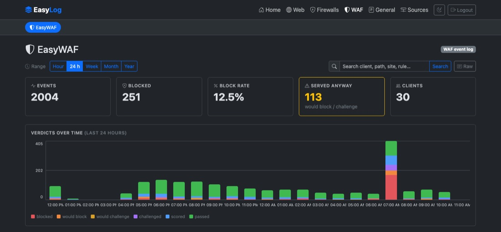
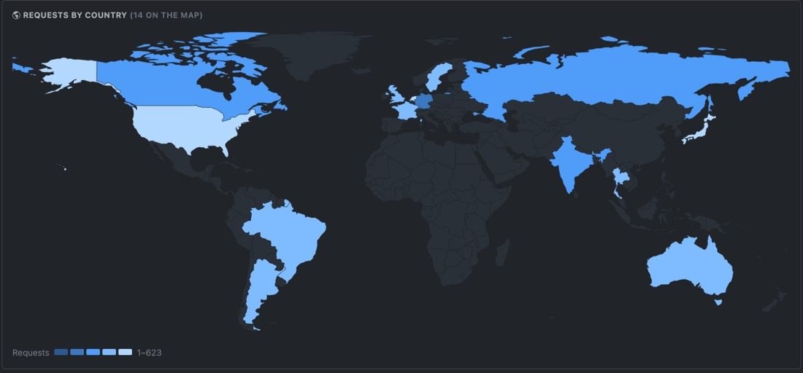

<header class="es-band es-nav">

<a href="." class="es-brand">

EasyLog
</a>
<nav class="es-nav-links" aria-label="Page sections">
<a href="#log-types">Log types</a>
<a href="#dashboards">Dashboards</a>
<a href="#architecture">Architecture</a>
<a href="#install">Install</a>
<a href="install/">Docs</a>
</nav>

<a class="es-btn es-btn--secondary" href="https://github.com/easysysio/EasyLog" target="_blank" rel="noopener noreferrer">
<svg width="16" height="16" viewBox="0 0 16 16" fill="currentColor" aria-hidden="true"><path d="M8 0C3.58 0 0 3.58 0 8c0 3.54 2.29 6.53 5.47 7.59.4.07.55-.17.55-.38 0-.19-.01-.82-.01-1.49-2.01.37-2.53-.49-2.69-.94-.09-.23-.48-.94-.82-1.13-.28-.15-.68-.52-.01-.53.63-.01 1.08.58 1.23.82.72 1.21 1.87.87 2.33.66.07-.52.28-.87.51-1.07-1.78-.2-3.64-.89-3.64-3.95 0-.87.31-1.59.82-2.15-.08-.2-.36-1.02.08-2.12 0 0 .67-.21 2.2.82.64-.18 1.32-.27 2-.27.68 0 1.36.09 2 .27 1.53-1.04 2.2-.82 2.2-.82.44 1.1.16 1.92.08 2.12.51.56.82 1.27.82 2.15 0 3.07-1.87 3.75-3.65 3.95.29.25.54.73.54 1.48 0 1.07-.01 1.93-.01 2.2 0 .21.15.46.55.38A8.013 8.013 0 0016 8c0-4.42-3.58-8-8-8z"></path></svg>
GitHub
</a>
<a class="es-btn es-btn--primary" href="#install">Get started</a>

</header>
<section class="es-band es-hero">

Log analyzer · part of EasySYS

<h1 class="es-h1">Every log source gets a dashboard of its own.</h1>

EasyLog collects syslog from your web servers, firewalls and WAFs, parses each source by type into an embedded DuckDB store, and turns it into live dashboards you can click straight through to the raw lines. One binary, and nothing leaves your network.

<a class="es-btn es-btn--primary es-btn--lg" href="#install">
Get started
<svg width="18" height="18" viewBox="0 0 24 24" fill="none" stroke="currentColor" stroke-width="2" stroke-linecap="round" stroke-linejoin="round" aria-hidden="true"><path d="M12 5v14M6 13l6 6 6-6"></path></svg>
</a>
<a class="es-btn es-btn--ghost es-btn--lg" href="install/">Read the docs</a>

<svg width="15" height="15" viewBox="0 0 24 24" fill="none" stroke="currentColor" stroke-width="2" stroke-linecap="round" stroke-linejoin="round" aria-hidden="true"><rect x="6" y="6" width="12" height="12" rx="2"></rect><path d="M9 2v4M15 2v4M9 18v4M15 18v4M2 9h4M2 15h4M18 9h4M18 15h4"></path></svg>Rust core
<svg width="15" height="15" viewBox="0 0 24 24" fill="none" stroke="currentColor" stroke-width="2" stroke-linecap="round" stroke-linejoin="round" aria-hidden="true"><path d="M21 8l-9-5-9 5v8l9 5 9-5V8z"></path><path d="M3 8l9 5 9-5M12 13v8"></path></svg>Single binary
<svg width="15" height="15" viewBox="0 0 24 24" fill="none" stroke="currentColor" stroke-width="2" stroke-linecap="round" stroke-linejoin="round" aria-hidden="true"><ellipse cx="12" cy="5.5" rx="7" ry="2.5"></ellipse><path d="M5 5.5v13c0 1.4 3.1 2.5 7 2.5s7-1.1 7-2.5v-13M5 12c0 1.4 3.1 2.5 7 2.5s7-1.1 7-2.5"></path></svg>Embedded DuckDB
<svg width="15" height="15" viewBox="0 0 24 24" fill="none" stroke="currentColor" stroke-width="2" stroke-linecap="round" stroke-linejoin="round" aria-hidden="true"><circle cx="12" cy="12" r="9"></circle><path d="M3 12h18M12 3a14 14 0 010 18M12 3a14 14 0 000 18"></path></svg>Offline geolocation

admin@web-01 — bash

# 1 — in EasyLog, register this host as an Apache source
# 2 — send it a line over syslog
$ logger --udp -n easylog -P 514 -t apache \
    "$(tail -n1 /var/log/apache2/access.log)"
# 3 — parsed, stored in DuckDB, on its dashboard
→ http://easylog:3000/web/apache

Ingest

syslog :514

State

one DuckDB file

Arch

x86_64 · arm64

Packaged for

Debian / Ubuntu
RHEL / Fedora
openSUSE / SLES
Air-gapped .deb / .rpm
x86_64 · arm64

</section>
<section id="log-types" class="es-band es-section">

Supported log types
<h2 class="es-h2">Nine log types. A dashboard built for each.</h2>

A web log asks how fast and how often. A firewall log asks what was denied. A WAF log asks what got through anyway. Each family gets the layout that answers its own question.

<svg width="26" height="26" viewBox="0 0 24 24" fill="none" stroke="currentColor" stroke-width="1.75" stroke-linecap="round" stroke-linejoin="round" aria-hidden="true"><circle cx="12" cy="12" r="9"></circle><path d="M3 12h18M12 3a14 14 0 010 18M12 3a14 14 0 000 18"></path></svg>

/web

Web servers &amp; proxies
<h3 class="es-h3">Requests, latency, status codes</h3>

Requests over time, error rate and bytes served, average and p95 request duration where the proxy logs it, and the top URLs, clients and countries behind them.

ApacheNginxCaddyHAProxyTraefik

<svg width="26" height="26" viewBox="0 0 24 24" fill="none" stroke="currentColor" stroke-width="1.75" stroke-linecap="round" stroke-linejoin="round" aria-hidden="true"><path d="M12 3l8 3v6c0 5-3.5 8.5-8 9-4.5-.5-8-4-8-9V6l8-3z"></path><path d="M4 12h16M12 6v15"></path></svg>

/firewall

Firewalls
<h3 class="es-h3">What was denied, and from where</h3>

A deny rate and the allow/deny split, top sources, destinations and ports, the rule that decided, and the application wherever PAN-OS identifies one.

Cisco ASAPalo Alto PAN-OS

<svg width="26" height="26" viewBox="0 0 24 24" fill="none" stroke="currentColor" stroke-width="1.75" stroke-linecap="round" stroke-linejoin="round" aria-hidden="true"><path d="M12 3l8 3v6c0 5-3.5 8.5-8 9-4.5-.5-8-4-8-9V6l8-3z"></path><path d="M9 12l2 2 4-4"></path></svg>

/waf

Web application firewall
<h3 class="es-h3">What the policy let through</h3>

Six verdicts stacked over time, a Served anyway count for requests an enforcing policy would have refused, the split per appliance and site, and the rules that fired.

EasyWAF

<svg width="26" height="26" viewBox="0 0 24 24" fill="none" stroke="currentColor" stroke-width="1.75" stroke-linecap="round" stroke-linejoin="round" aria-hidden="true"><path d="M14 3H6a1 1 0 00-1 1v16a1 1 0 001 1h12a1 1 0 001-1V8l-5-5z"></path><path d="M14 3v5h5M8 13h8M8 17h6"></path></svg>

/general

Everything else
<h3 class="es-h3">Raw lines, kept and searchable</h3>

For a device EasyLog has no parser for: every line stored exactly as it arrived, with volume over time, the top senders, hostnames and tags, and full-text search.

Any syslog source

</section>
<section id="dashboards" class="es-band es-section es-subtle">

Dashboards
<h2 class="es-h2">From a spike on the timeline to the lines that caused it.</h2>

Every panel is a filter. Click a bar, a status class, a country or a client and the whole dashboard follows, and the raw log lines behind it are one button away.

<svg width="22" height="22" viewBox="0 0 24 24" fill="none" stroke="currentColor" stroke-width="1.75" stroke-linecap="round" stroke-linejoin="round" aria-hidden="true"><path d="M3 5h18l-7 8v6l-4-2v-4L3 5z"></path></svg>

<h3 class="el-feature-title">Click to filter</h3>

Every URL, client, status class, rule and country is a link. Filters stack as removable chips and live in the URL, so any view can be shared.

<svg width="22" height="22" viewBox="0 0 24 24" fill="none" stroke="currentColor" stroke-width="1.75" stroke-linecap="round" stroke-linejoin="round" aria-hidden="true"><circle cx="11" cy="11" r="7"></circle><path d="M21 21l-4.3-4.3M11 8v6M8 11h6"></path></svg>

<h3 class="el-feature-title">Zoom into a period</h3>

Click the 2am bar and the page is pinned to 02:00–03:00, re-bucketed into five-minute bars. Keep clicking and you reach a single minute.

<svg width="22" height="22" viewBox="0 0 24 24" fill="none" stroke="currentColor" stroke-width="1.75" stroke-linecap="round" stroke-linejoin="round" aria-hidden="true"><path d="M8 6h13M8 12h13M8 18h13M3 6h.01M3 12h.01M3 18h.01"></path></svg>

<h3 class="el-feature-title">Raw lines, one click away</h3>

The Raw button swaps the charts for the log lines behind them, under the same filters. Page through them, or download every matching line.

<svg width="22" height="22" viewBox="0 0 24 24" fill="none" stroke="currentColor" stroke-width="1.75" stroke-linecap="round" stroke-linejoin="round" aria-hidden="true"><circle cx="11" cy="11" r="7"></circle><path d="M21 21l-4.3-4.3"></path></svg>

<h3 class="el-feature-title">Search every field</h3>

One box across URLs, clients, agents, rules, ports and applications. It narrows the KPIs, the charts and the map together.

<svg width="22" height="22" viewBox="0 0 24 24" fill="none" stroke="currentColor" stroke-width="1.75" stroke-linecap="round" stroke-linejoin="round" aria-hidden="true"><path d="M9 4L3 6v14l6-2 6 2 6-2V4l-6 2-6-2z"></path><path d="M9 4v14M15 6v14"></path></svg>

<h3 class="el-feature-title">Offline world map</h3>

Client addresses are resolved to countries at ingest, from a database bundled in the binary. No lookup ever leaves the machine.

<svg width="22" height="22" viewBox="0 0 24 24" fill="none" stroke="currentColor" stroke-width="1.75" stroke-linecap="round" stroke-linejoin="round" aria-hidden="true"><ellipse cx="12" cy="5.5" rx="7" ry="2.5"></ellipse><path d="M5 5.5v13c0 1.4 3.1 2.5 7 2.5s7-1.1 7-2.5v-13M5 12c0 1.4 3.1 2.5 7 2.5s7-1.1 7-2.5"></path></svg>

<h3 class="el-feature-title">Bounded storage</h3>

Set a retention window and old events are pruned every hour. The database is compacted at startup to hand the disk back.

</section>
<section id="architecture" class="es-band es-section">

Architecture
<h2 class="es-h2">One binary between your devices and your dashboards</h2>

Devices send syslog the way they already can. EasyLog routes each message by the address it came from, parses it by type, and stores it as rows in DuckDB. Every dashboard is a live query over them.

<svg viewBox="0 0 1120 440" role="img" aria-label="Diagram: web servers and proxies, firewalls and EasyWAF send logs to EasyLog, which routes each message by source IP, parses it by type and stores it in DuckDB; administrators use the dashboards over HTTP.">
<defs>
<marker id="el-ah" viewBox="0 0 10 10" refX="9" refY="5" markerWidth="7" markerHeight="7" orient="auto-start-reverse"><path class="a-head" d="M0 0L10 5L0 10z"></path></marker>
<marker id="el-ahb" viewBox="0 0 10 10" refX="9" refY="5" markerWidth="7" markerHeight="7" orient="auto-start-reverse"><path class="a-head a-head--es" d="M0 0L10 5L0 10z"></path></marker>
</defs>
<text class="a-lane" x="0" y="14">SOURCES</text>
<text class="a-lane" x="300" y="14">EASYLOG</text>
<text class="a-lane" x="900" y="14">YOU</text>
<g class="a-ext"><rect x="0" y="46" width="220" height="76" rx="10"></rect><text class="a-title" x="20" y="78">Web servers &amp; proxies</text><text class="a-sub" x="20" y="102">Nginx · Apache · Caddy</text></g>
<g class="a-ext"><rect x="0" y="182" width="220" height="76" rx="10"></rect><text class="a-title" x="20" y="214">Firewalls</text><text class="a-sub" x="20" y="238">Cisco ASA · PAN-OS</text></g>
<g class="a-es"><rect x="0" y="318" width="220" height="88" rx="10"></rect><text class="a-title" x="22" y="354">EasyWAF</text><text class="a-sub" x="22" y="380">event log · logfmt</text></g>
<g class="a-es"><rect x="300" y="30" width="560" height="386" rx="14"></rect><text class="a-title" x="324" y="66">EasyLog</text><text class="a-sub" x="324" y="90">one binary · syslog :514 UDP/TCP</text></g>
<g class="a-box"><rect x="324" y="132" width="150" height="80" rx="10"></rect><text class="a-title" x="340" y="164">Route</text><text class="a-sub" x="340" y="188">by source IP</text></g>
<g class="a-box"><rect x="505" y="132" width="150" height="80" rx="10"></rect><text class="a-title" x="521" y="164">Parse</text><text class="a-sub" x="521" y="188">9 log types</text></g>
<g class="a-box"><rect x="686" y="132" width="150" height="80" rx="10"></rect><text class="a-title" x="702" y="164">DuckDB</text><text class="a-sub" x="702" y="188">columnar rows</text></g>
<g class="a-box"><rect x="324" y="292" width="150" height="92" rx="10"></rect><text class="a-title" x="340" y="328">Sources</text><text class="a-sub" x="340" y="354">IP → log type</text></g>
<g class="a-box"><rect x="505" y="292" width="331" height="92" rx="10"></rect><text class="a-title" x="523" y="328">Dashboards · raw view · search</text><text class="a-sub" x="523" y="354">live SQL · web UI :3000</text></g>
<g class="a-ext"><rect x="900" y="300" width="220" height="76" rx="10"></rect><text class="a-title" x="920" y="332">Administrators</text><text class="a-sub" x="920" y="356">any browser</text></g>
<path class="a-line" fill="none" d="M220 84 H270 V158 H322" marker-end="url(#el-ah)"></path>
<text class="a-label" x="226" y="76">syslog</text>
<path class="a-line" fill="none" d="M220 220 H270 V172 H322" marker-end="url(#el-ah)"></path>
<text class="a-label" x="226" y="212">syslog</text>
<path class="a-line a-line--es" fill="none" d="M220 362 H270 V186 H322" marker-end="url(#el-ahb)"></path>
<text class="a-label a-label--es" x="226" y="354">logfmt</text>
<line class="a-line a-line--es" x1="474" y1="172" x2="503" y2="172" marker-end="url(#el-ahb)"></line>
<line class="a-line a-line--es" x1="655" y1="172" x2="684" y2="172" marker-end="url(#el-ahb)"></line>
<line class="a-line" x1="399" y1="292" x2="399" y2="214" marker-end="url(#el-ah)"></line>
<line class="a-line a-line--es" x1="761" y1="212" x2="761" y2="290" marker-end="url(#el-ahb)"></line>
<text class="a-label a-label--es" x="773" y="256">queries</text>
<line class="a-line a-line--es" x1="836" y1="338" x2="898" y2="338" marker-end="url(#el-ahb)"></line>
<text class="a-label" x="879" y="328" text-anchor="middle">HTTP</text>
</svg>

EasySYS service
Your existing infrastructure
Sources are mapped to log types in the web UI, with no config file to edit.

</section>
<section id="install" class="es-band es-section es-subtle">

Deploy
<h2 class="es-h2">Running in minutes. Upgraded like everything else.</h2>

EasyLog installs from the signed EasySYS package repository, starts on boot under systemd, and upgrades through the package manager you already use. The <a href="install/">installation guide</a> has the details.

1

Add the signed repository

Signed apt, yum and zypper channels, for x86_64 and arm64.

2

Install and enable the service

It starts on boot and listens for syslog on port 514.

3

Create your admin, add a source

Open the web UI on port 3000 and map a sending host to its log type.

<input class="es-os-radio" type="radio" name="es-os" id="es-os-deb" checked />
<input class="es-os-radio" type="radio" name="es-os" id="es-os-rpm" />
<input class="es-os-radio" type="radio" name="es-os" id="es-os-suse" />
<input class="es-os-radio" type="radio" name="es-os" id="es-os-air" />

<label for="es-os-deb">Debian / Ubuntu</label>
<label for="es-os-rpm">RHEL / Fedora</label>
<label for="es-os-suse">openSUSE / SLES</label>
<label for="es-os-air">Air-gapped</label>

# 1 — trust the repository
$ curl -fsSL https://repo.easysys.io/easylog/stable/debian/key.gpg \
    | sudo gpg --dearmor -o /usr/share/keyrings/easysys.gpg
$ echo "deb [signed-by=/usr/share/keyrings/easysys.gpg] \
    https://repo.easysys.io/easylog/stable/debian ./" \
    | sudo tee /etc/apt/sources.list.d/easylog.list
# 2 — install and start
$ sudo apt update &amp;&amp; sudo apt install easylog
$ sudo systemctl enable --now easylog
# 3 — create your admin
→ http://&lt;host&gt;:3000/

# 1 — trust the repository
$ sudo tee /etc/yum.repos.d/easylog.repo &gt;/dev/null &lt;&lt;'EOF'
[easylog]
name=EasyLog
baseurl=https://repo.easysys.io/easylog/stable/redhat
enabled=1
gpgcheck=1
gpgkey=https://repo.easysys.io/easylog/stable/redhat/key.gpg
EOF
# 2 — install and start
$ sudo dnf install easylog
$ sudo systemctl enable --now easylog
# 3 — create your admin
→ http://&lt;host&gt;:3000/

# 1 — trust the repository
$ sudo zypper addrepo -fg \
    https://repo.easysys.io/easylog/stable/redhat easylog
# 2 — install and start
$ sudo zypper install easylog
$ sudo systemctl enable --now easylog
# 3 — create your admin
→ http://&lt;host&gt;:3000/

# 1 — download the package for your architecture
#     github.com/easysysio/EasyLog/releases
# 2 — install and start
$ sudo dpkg -i easylog_*_amd64.deb     # or _arm64.deb
$ sudo rpm  -i easylog-*.x86_64.rpm    # or .aarch64.rpm
$ sudo systemctl enable --now easylog
# 3 — create your admin
→ http://&lt;host&gt;:3000/

</section>
<section class="es-band es-cta">

<svg class="es-cta-hex" viewBox="0 0 512 512" aria-hidden="true"><polygon points="86,256 171,109 341,109 426,256 341,403 171,403" fill="none" stroke="#ffffff" stroke-width="34" stroke-linejoin="round"></polygon></svg>

<h2 class="es-h2">Start with one source.</h2>

Point a single web server or firewall at EasyLog and watch its dashboard fill up. MIT licensed and developed in the open.

<a class="es-btn es-btn--primary es-btn--lg" href="install/">Read the docs</a>
<a class="es-btn es-btn--on-dark es-btn--lg" href="https://github.com/easysysio/EasyLog" target="_blank" rel="noopener noreferrer">GitHub</a>

</section>
<footer class="es-band es-footer">

<a href="." class="es-brand">EasyLog</a>

A dashboard for every log source. Part of the <a href="https://easysys.io">EasySYS</a> suite.

Documentation
<a href="install/">Installation</a>
<a href="configuration/">Configuration</a>
<a href="sending-logs/">Sending logs</a>
<a href="dashboards/">Dashboards</a>
<a href="reference/">Reference</a>

EasySYS
<a href="https://easysys.io">easysys.io</a>
<a href="https://easywaf.easysys.io">EasyWAF</a>
<a href="https://easyvault.easysys.io">EasyVault</a>
<a href="https://easydc.easysys.io">EasyDC</a>
<a href="https://www.easynas.org">EasyNAS</a>

Community
<a href="https://github.com/easysysio/EasyLog">GitHub</a>
<a href="https://github.com/easysysio/EasyLog/releases">Releases</a>
<a href="https://repo.easysys.io">Package repository</a>
<a href="https://discord.gg/easysys">Discord</a>

© 2026 EasySYS · MIT licensed
easylog.easysys.io

</footer>

