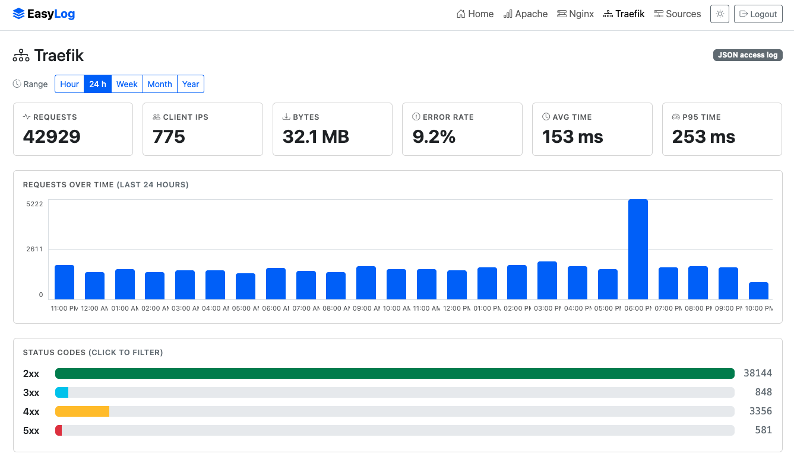
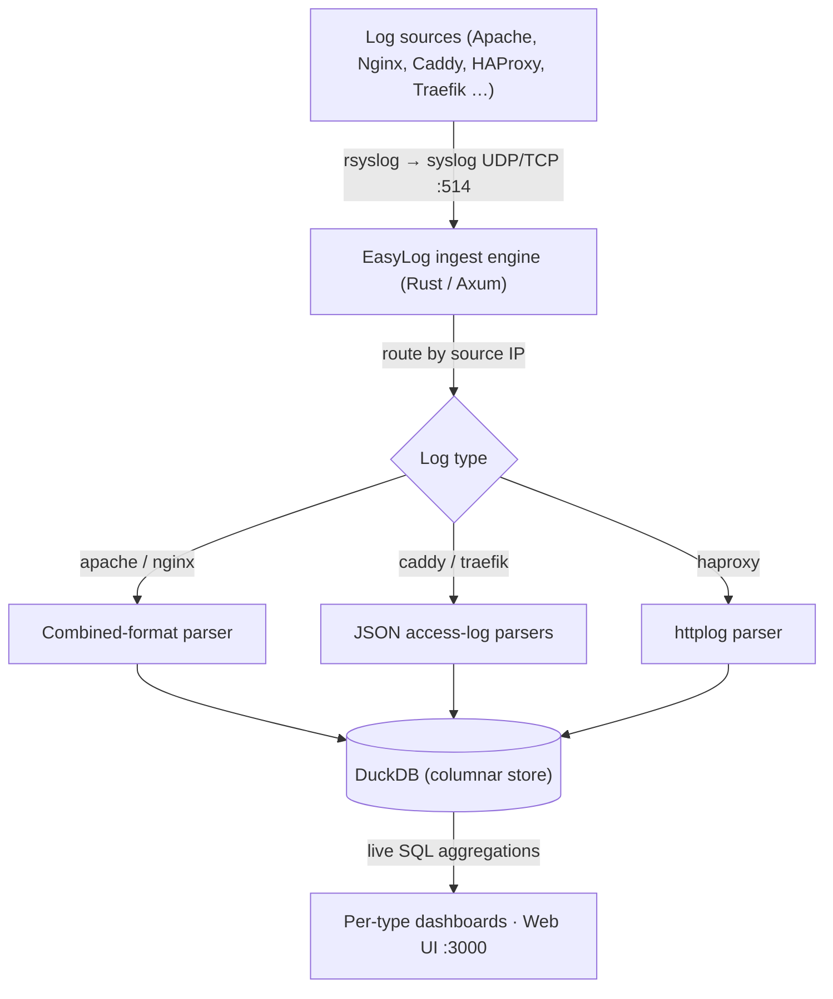
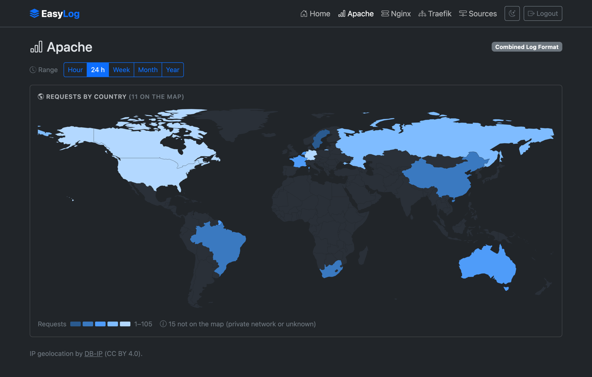

# EasyLog

**A multi-log analyzer with a dedicated dashboard for every log type.**

EasyLog ingests logs over **syslog**, parses each source by type, stores the parsed events in an embedded **DuckDB** column store, and serves a live **dashboard per log type** — all from a single, self-contained binary. Instead of a wall of raw text, you get clear metrics, charts, and drill-down tailored to each source.

<figure markdown="span">
  { loading=lazy }
  <figcaption>The Traefik dashboard: KPI cards (including request duration), a requests-over-time chart, and a status-code breakdown.</figcaption>
</figure>

---

## Architecture



Incoming syslog messages are routed to a parser by the **sending host's IP**, which you map to a log type in the web UI. Parsed events are stored as rows — the source of truth — and every dashboard is a live SQL query over them, so you can always drill down to the underlying requests.

---

## Features

*   **Syslog ingestion** over both **UDP and TCP** (RFC 3164 & RFC 5424).
*   **Pluggable log types** — each type owns its parser, storage schema, and dashboard.
*   **DuckDB storage** — parsed events stored as rows; dashboards run live analytical SQL, so new views never need a re-ingest.
*   **A dashboard per log type** — KPI cards, a requests timeline, status-code breakdowns, and top-N tables, with **click-to-filter drill-down** and a **time-range selector** (hour / 24h / week / month / year).
*   **IP geolocation, fully offline** — every client IP is resolved to a country at ingest, driving a Countries KPI, a Top-countries panel, and a **shaded world map** you can click to filter. The country database is bundled in the binary; no lookups leave the machine.
*   **Overview home page** — cross-type KPIs (total logs, logs/min, countries), a world map across all log types, and pie charts by source, type, and country.
*   **Authentication** — admin account created on first run; the web UI is login-protected. Syslog ingestion stays open.
*   **Single self-contained binary** — templates and assets are compiled in; nothing to install alongside it. Light/dark theme, fully offline (no CDN).
*   **First-class packaging** — `.deb` and `.rpm` for **x86_64 and arm64**, with a systemd unit.

---

## Supported log types

Dashboards are grouped into **Web**, **Firewalls**, **WAF** and **General**; each group gets a layout suited to the question it answers — response times for web logs, what got blocked and where it came from for firewalls, and what the policy *let through* for the WAF.

| Log source | Format | Dashboard highlights |
|---|---|---|
| **Apache HTTPD** | Common / Combined | Requests, status codes, top URLs & client IPs |
| **Nginx** | Combined access log | Requests, status codes, top URLs & client IPs |
| **Caddy** | JSON access log | The above **plus** avg & p95 request duration |
| **HAProxy** | `option httplog` | The above **plus** top backends/servers and avg & p95 duration |
| **Traefik** | JSON access log | The above **plus** top routers/services and **avg & p95 request duration** |
| **Cisco ASA** | ASA syslog message IDs | Deny rate, allow/deny split, top sources/destinations/ports, top access-lists |
| **Palo Alto** | PAN-OS TRAFFIC log | The above **plus** top applications (App-ID) and security rules |
| **EasyWAF** | logfmt event log (0.9.0+) | Verdicts stacked over time, **Served anyway** (would block / challenge), per-appliance split, top rules fired, top clients |
| **General logs** | anything, unparsed | Lines over time, top senders/hostnames/tags, full-text search, raw lines |

!!! tip "Adding more types is by design"
    A new log type is a self-contained module (parser + storage + dashboard), and it brings its own navigation entry with it. Apache and Nginx share the combined-format engine; Caddy, HAProxy and Traefik share the renderer for logs that carry a request duration, each declaring its own routing dimensions — routers/services for Traefik, backends/servers for HAProxy.

---

## Installation

EasyLog ships as a single binary and installs a **service** that starts on boot.
Install it from the EasySYS package repository so upgrades come through your
package manager. Packages are published for **x86_64** and **arm64**; your
package manager picks the right one.

=== "Debian / Ubuntu"

    ```bash
    # Add the EasyLog repository (signed)
    curl -fsSL https://repo.easysys.io/easylog/stable/debian/key.gpg \
      | sudo gpg --dearmor -o /usr/share/keyrings/easysys.gpg
    echo "deb [signed-by=/usr/share/keyrings/easysys.gpg] https://repo.easysys.io/easylog/stable/debian ./" \
      | sudo tee /etc/apt/sources.list.d/easylog.list

    sudo apt update
    sudo apt install easylog
    sudo systemctl enable --now easylog
    ```

=== "RHEL / Fedora"

    ```bash
    sudo tee /etc/yum.repos.d/easylog.repo >/dev/null <<'EOF'
    [easylog]
    name=EasyLog
    baseurl=https://repo.easysys.io/easylog/stable/redhat
    enabled=1
    gpgcheck=1
    gpgkey=https://repo.easysys.io/easylog/stable/redhat/key.gpg
    EOF

    sudo dnf install easylog
    sudo systemctl enable --now easylog
    ```

=== "openSUSE / SLES"

    ```bash
    sudo zypper addrepo -fg https://repo.easysys.io/easylog/stable/redhat easylog
    sudo zypper install easylog
    sudo systemctl enable --now easylog
    ```

=== "Manual download"

    For air-gapped hosts, grab the `.deb` or `.rpm` for your architecture from the
    [releases page](https://github.com/easysysio/EasyLog/releases):

    ```bash
    sudo dpkg -i easylog_*_amd64.deb     # or _arm64.deb
    sudo rpm  -i easylog-*.x86_64.rpm    # or .aarch64.rpm
    sudo systemctl enable --now easylog
    ```

    Upgrades then mean downloading the next package by hand — the repository is
    the easier path where the host has network access.

The package installs the binary to `/usr/bin/easylog`, a default config to `/etc/easylog/easylog.toml`, and a systemd unit; the database lives in `/var/lib/easylog`. The service runs as root (standard for a syslog collector binding port 514).

Then open `http://<host>:3000/` — on first run you'll be prompted to **create the admin account**, after which the UI requires login.

---

## Configuration

EasyLog reads `/etc/easylog/easylog.toml` (override the path with the `EASYLOG_CONFIG` environment variable):

```toml
syslog_bind = "0.0.0.0"   # address the UDP + TCP listeners bind to
syslog_port = 514         # standard syslog; use 5514 to run without privileges
web_port    = 3000        # web UI / dashboards
db_path     = "/var/lib/easylog/easylog.duckdb"
geo_db_path = ""          # external MaxMind .mmdb; empty = bundled DB-IP Lite

retention_days = 0        # delete events older than N days; 0 = keep everything
auto_compact   = true     # rewrite the database at startup to reclaim disk

log_dir        = "/var/log/easylog"   # EasyLog's own logs; "" = stdout only
log_level      = "info"               # RUST_LOG overrides this
log_keep_days  = 14                   # daily rotation, files kept
```

### EasyLog's own logs

Besides stdout (so `journalctl -u easylog` works as before), EasyLog writes two files under **`log_dir`**, created by the systemd unit:

* **`easylog.log`** — operations: startup and configuration, which geolocation database is in use, retention prunes and compactions, and a per-minute ingest summary counting messages *received*, *stored*, *unparsed*, from an *unknown source*, and dropped because the write queue was full. That summary is the quickest way to tell whether a device is really sending, and whether its lines are being understood.
* **`audit.log`** — who did what: sign-ins and failed attempts, sign-outs, first-run administrator creation, and sources added or removed, each with the account and the client address.

Both roll daily and keep `log_keep_days` files (default 14), so there's nothing to configure in logrotate. If the directory can't be written — a source build running unprivileged, say — EasyLog logs a warning and continues on stdout instead of failing to start.

### Keeping the database bounded

EasyLog keeps every event by default, which is fine until a busy source fills the
disk. Set **`retention_days`** and anything older is deleted — at startup and
hourly after that, across all log types. Events are aged by their own timestamp,
falling back to when EasyLog received them, so a line whose timestamp couldn't be
parsed is pruned too rather than living forever.

Deleting rows bounds the database but doesn't hand disk back: DuckDB reuses freed
space internally and never shrinks the file, so it stays at its high-water mark.
**`auto_compact`** (on by default) closes that gap by rewriting the database into
a fresh file at startup whenever a large share of it is dead space. It runs before
ingestion begins and keeps the original until the new file is safely in place, so
an interrupted compaction leaves your data untouched.

!!! tip "Where to see it"
    The **Storage** card on the overview shows the database size on disk and the
    active retention window. To reclaim disk right after shortening the window,
    restart the service — that's when compaction runs.

!!! note
    Log **sources** are not configured here — they're managed in the web UI (next section), so you never have to edit and reload a file to add a host.

---

## Sending logs to EasyLog

There are two steps: tell EasyLog which host sends which log type, then forward the logs.

### 1. Register the source

In the web UI, open **Sources** (`/sources`) and add the sending host's **IP address** with its **log type** (`apache`, `nginx`, or `traefik`). EasyLog routes incoming syslog by source IP — traffic from unregistered hosts is dropped.

### 2. Forward the logs

Point the host's log file at EasyLog's syslog port with `rsyslog`'s `imfile` module. Polling mode is recommended for reliability inside containers.

=== "Apache / Nginx"

    `/etc/rsyslog.d/60-easylog.conf` on the web server:

    ```rsyslog
    module(load="imfile" mode="polling" pollingInterval="2")

    input(type="imfile"
          File="/var/log/apache2/access.log"   # nginx: /var/log/nginx/access.log
          Tag="apache"
          ruleset="easylog_forward")

    ruleset(name="easylog_forward") {
        action(type="omfwd" target="EASYLOG_IP" port="514"
               protocol="udp" template="RSYSLOG_ForwardFormat")
    }
    ```

=== "Traefik"

    Enable JSON access logs in `traefik.yml`:

    ```yaml
    accessLog:
      filePath: /var/log/traefik/access.log
      format: json
    ```

    …then forward `/var/log/traefik/access.log` with the same `imfile` config as above, using `Tag="traefik"`.

=== "Caddy"

    Enable the JSON access log for a site in your `Caddyfile`:

    ```caddyfile
    example.com {
        log {
            output file /var/log/caddy/access.log
            format json
        }
    }
    ```

    …then forward `/var/log/caddy/access.log` with the same `imfile` config as above, using `Tag="caddy"`. Caddy's own lifecycle messages in that stream are ignored by the parser.

=== "Anything else"

    Set the source's type to **General logs** and forward the file or stream as usual — EasyLog stores each line exactly as it arrives, with no parser involved. Useful for a device EasyLog doesn't understand yet, or just to see what a host is actually sending before deciding what to do with it.

    Note this is a type you choose per source: traffic from hosts you haven't registered is still ignored, and a line a *typed* source's parser rejects is still dropped rather than falling through to here.

=== "Cisco ASA"

    On the ASA, send syslog straight to EasyLog:

    ```
    logging enable
    logging timestamp
    logging trap informational
    logging host inside EASYLOG_IP
    ```

    EasyLog reads the connection and access-decision messages (106023, 106100, 106001, 302013–302016) and ignores the rest of the ASA's chatter.

=== "Palo Alto"

    In **Device → Server Profiles → Syslog**, add a profile pointing at `EASYLOG_IP:514` (UDP), then attach it to a **Log Forwarding** profile for **Traffic** logs and reference that profile from your security rules. EasyLog parses TRAFFIC records; THREAT, SYSTEM and CONFIG logs are ignored.

=== "EasyWAF"

    EasyWAF ships its event log itself: point `syslog_host` / `syslog_port` in its `config.toml` at EasyLog, register the appliance as a source of type **EasyWAF**, and every proxied request arrives as one line carrying its verdict, score and the rules that fired.

    Delivery is deliberately fire-and-forget — EasyWAF drops lines rather than blocking its own request path — so treat the counts as what arrived, not as a guaranteed tally of every request served. Several appliances can send to one EasyLog; each event keeps the address it came from, which is what the per-appliance table is built on.

=== "HAProxy"

    HAProxy speaks syslog natively — no `imfile` needed. In `haproxy.cfg`:

    ```haproxy
    global
        log EASYLOG_IP:514 local0

    defaults
        log     global
        option  httplog
    ```

    `option httplog` is required: the TCP log format carries no status code or request line, so those lines are dropped.

Apply and restart:

```bash
sudo rsyslogd -N1            # validate config
sudo systemctl restart rsyslog
```

!!! warning "Log format & reverse proxies"
    EasyLog parses both **Common** and **Combined** access-log formats — Nginx's default `combined` and Apache's `combined`/`common` all work out of the box. If a host sits behind a reverse proxy, configure it to log the real client IP (e.g. `mod_remoteip` / `X-Forwarded-For`) so the dashboards show visitors rather than the proxy.

---

## Dashboards

Each log type has its own dashboard, and the home page rolls everything up:

*   **KPI cards** — requests, unique client IPs, bytes served, error rate (and avg/p95 duration for Traefik).
*   **Requests over time** — a zero-filled timeline that spans the whole selected range, shown in **your browser's local timezone**. Every bar is clickable: see [Zooming into a period](#zooming-into-a-period).
*   **Status codes** — 2xx / 3xx / 4xx / 5xx breakdown; click a class to filter.
*   **Top URLs & client IPs** (and **routers / services** for Traefik) — click any row to filter the whole dashboard. Filters stack and are shareable by URL.
*   **Requests by country** — a **Top countries** panel and a world map shaded by request volume; hover a country for its exact count, click it to filter.

Use the time-range buttons (**Hour · 24h · Week · Month · Year**) to bound everything, and click chart elements — including the timeline's bars — to drill in — the URL captures the active filters, so views are bookmarkable.

### Zooming into a period

Spotted a spike at 2am? **Click the bar.** The whole dashboard — KPIs, charts, panels, world map, and the raw view behind it — is pinned to that period, 02:00 to 03:00, and the timeline re-buckets *inside* the hour into five-minute bars. Click one of those and you are down to five minutes; keep going and you reach a minute. It is the fastest way from "something happened around then" to the handful of lines that caused it.

The pinned period appears as a removable chip (in your local timezone, like the timeline labels), stacks with search and every drill-down filter, and lives in the URL as `?from=&to=` epoch seconds — so a zoomed-in view is as shareable as any other. Removing the chip, or picking a time range, returns to the plain range.

### From charts to the actual lines

Every dashboard has a **Raw** button. It replaces the charts with the log lines behind them — newest first — and the **Dashboard** button switches back. It's a mode of the dashboard rather than a separate page, so the time range, every drill-down filter and the search term still apply: narrow to what you're investigating, hit Raw, and you're looking at exactly those events as the device sent them. The URL carries `view=raw`, so that stays shareable too.

Lines load 200 at a time with **Load more**, and **Download** saves every line matching the current filters as a `.log` file — handy for handing evidence to someone or grepping offline. Large exports are read in batches so they never stall ingestion, and stop at 500,000 lines (the file says so if it gets there).

### Searching

Every dashboard has a **search box** beside the range selector. It matches free text across the fields that type records — URL, client IP, user agent and host on the web dashboards (plus routers/services or backends/servers), and source, destination, port, rule, application, zone and protocol on the firewalls.

Matching is case-insensitive substring, so `203.0.113` finds a whole subnet, `/admin` finds every path containing it, and `443` finds traffic to that port. Search behaves like any other filter: it narrows the KPIs, the timeline, every panel and the world map together, stacks with whatever drill-down is already active, appears as a removable chip, and is part of the URL — so a search is as shareable as any other view.

Dashboards are grouped by **category** in the navigation: the top row picks a category — **Web**, **Firewalls**, **WAF**, **General**, with **3rd parties** appearing as those log types land — and the row beneath it lists that category's dashboards. Each dashboard lives under its category, e.g. `/web/apache` or `/waf/easywaf`; the older flat paths such as `/apache` redirect there, so existing bookmarks keep working.

### The WAF dashboard

EasyWAF's dashboard asks a different question from the firewall ones. A firewall dashboard splits traffic two ways — allowed or denied. A WAF has six verdicts, and the interesting ones are not the blocks:

*   `blocked` — refused, the attack stopped.
*   `would_block` / `would_challenge` — **served**, because the policy is in DetectionOnly. An enforcing policy would have refused them.
*   `scored` — served because the rules that matched didn't reach the block threshold. This is where reconnaissance shows up.
*   `challenged`, `passed` — a CAPTCHA was shown, or nothing matched at all.

So the dashboard leads with a **Served anyway** card counting `would_block` + `would_challenge` — on a DetectionOnly policy that is the number that justifies enforcing — and stacks all six verdicts on the timeline, worst at the foot of each bar. Below it, **By appliance and site** repeats the split for every EasyWAF sending in, which is the view a single appliance cannot produce and the main reason to ship the logs at all. **Top rules fired** unnests the rule list, so a rule dominating `scored` against ordinary traffic stands out as a tuning candidate, while one dominating `blocked` is doing its job. Everything filters, and filters stack: rule 942100 + verdict `scored` + last hour is three clicks.

### Where your traffic comes from

Each client IP is resolved to a country as the log line is ingested, so every dashboard — and the home overview — can show traffic geographically.

<figure markdown="span">
  { loading=lazy }
  <figcaption>Requests by country, shaded over five steps. Clicking a country filters the whole dashboard to its traffic.</figcaption>
</figure>

The shading uses a **logarithmic scale**, so a single dominant country doesn't flatten everything else into one shade. Clients that can't be placed on the map — private-network addresses (`10.0.0.0/8`, `192.168.0.0/16`, …) and unresolved IPs — are never silently dropped: they're counted under the map and listed in the Top-countries panel as *Private network* and *Unknown*.

The map composes with everything else on the page: pick a range, click a status class, then click a country, and the KPIs, timeline, and tables all follow. Country filters appear as removable chips like any other filter.

!!! note "Lookups are offline, and swappable"
    EasyLog **bundles the DB-IP Lite country database** in the binary — nothing to install, and no IP ever leaves your machine. To use a fresher or more detailed database, point `geo_db_path` at any MaxMind-format `.mmdb` (e.g. MaxMind GeoLite2) and restart. Countries are resolved **at ingest time**, so a database change applies to newly received logs, not to rows already stored.

---

## Why EasyLog

*   **Memory-safe core** — written in Rust on the Axum framework for speed and safety.
*   **No heavy database** — DuckDB is embedded; there's no separate server to run, yet it's built for fast aggregation over millions of rows.
*   **Operationally simple** — one binary, one config file, systemd-managed, packaged for the Debian and RHEL families on both x86_64 and arm64.

---

## Bundled data

*   IP geolocation by [DB-IP](https://db-ip.com) — the DB-IP Lite country database, licensed [CC BY 4.0](https://creativecommons.org/licenses/by/4.0/).
*   Country boundaries from [Natural Earth](https://www.naturalearthdata.com/) (public domain).
