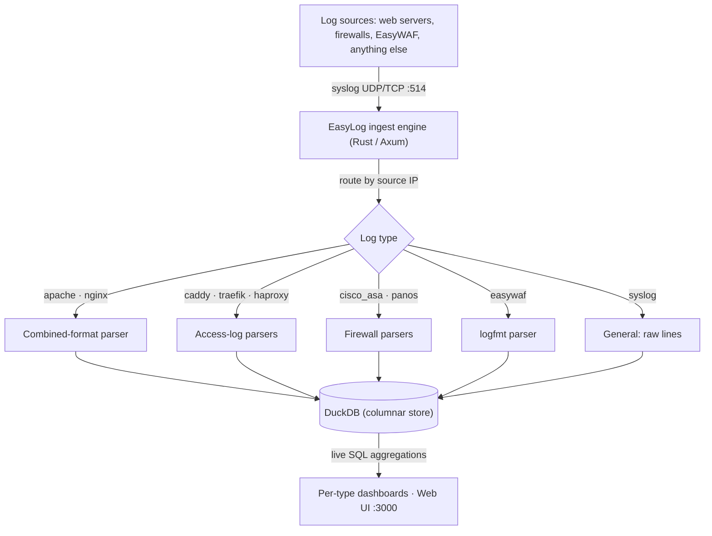

# Reference

## Supported log types
Dashboards are grouped into **Web**, **Firewalls**, **WAF** and **General**; each group gets a layout suited to the question it answers — response times for web logs, what got blocked and where it came from for firewalls, and what the policy *let through* for the WAF.

| Log source | Format | Dashboard highlights |
|---|---|---|
| **Apache HTTPD** | Common / Combined | Requests, status codes, top URLs & client IPs |
| **Nginx** | Combined access log | Requests, status codes, top URLs & client IPs |
| **Caddy** | JSON access log | The above **plus** avg & p95 request duration |
| **HAProxy** | `option httplog` | The above **plus** top backends/servers and avg & p95 duration |
| **Traefik** | JSON access log | The above **plus** top routers/services and **avg & p95 request duration** |
| **Cisco ASA** | ASA syslog message IDs | Deny rate, allow/deny split, top sources/destinations/ports, top access-lists |
| **Palo Alto** | PAN-OS TRAFFIC log | The above **plus** top applications (App-ID) and security rules |
| **EasyWAF** | logfmt event log (0.9.0+) | Verdicts stacked over time, **Served anyway** (would block / challenge), per-appliance split, top rules fired, top clients |
| **General logs** | anything, unparsed | Lines over time, top senders/hostnames/tags, full-text search, raw lines |

!!! tip "Adding more types is by design"
    A new log type is a self-contained module (parser + storage + dashboard), and it brings its own navigation entry with it. Apache and Nginx share the combined-format engine; Caddy, HAProxy and Traefik share the renderer for logs that carry a request duration, each declaring its own routing dimensions — routers/services for Traefik, backends/servers for HAProxy.

## Architecture

Incoming syslog messages are routed to a parser by the **sending host's IP**, which you map to a log type in the web UI. Parsed events are stored as rows — the source of truth — and every dashboard is a live SQL query over them, so you can always drill down to the underlying requests.

## Features

*   **Syslog ingestion** over both **UDP and TCP** (RFC 3164 & RFC 5424).
*   **Pluggable log types** — each type owns its parser, storage schema, and dashboard.
*   **DuckDB storage** — parsed events stored as rows; dashboards run live analytical SQL, so new views never need a re-ingest.
*   **A dashboard per log type** — KPI cards, a requests timeline, status-code breakdowns, and top-N tables, with **click-to-filter drill-down** and a **time-range selector** (hour / 24h / week / month / year).
*   **IP geolocation, fully offline** — every client IP is resolved to a country at ingest, driving a Countries KPI, a Top-countries panel, and a **shaded world map** you can click to filter. The country database is bundled in the binary; no lookups leave the machine.
*   **Overview home page** — cross-type KPIs (total logs, logs/min, countries), a world map across all log types, and pie charts by source, type, and country.
*   **Authentication** — admin account created on first run; the web UI is login-protected. Syslog ingestion stays open.
*   **Single self-contained binary** — templates and assets are compiled in; nothing to install alongside it. Light/dark theme, fully offline (no CDN).
*   **First-class packaging** — `.deb` and `.rpm` for **x86_64 and arm64**, with a systemd unit.

## Why EasyLog

*   **Memory-safe core** — written in Rust on the Axum framework for speed and safety.
*   **No heavy database** — DuckDB is embedded; there's no separate server to run, yet it's built for fast aggregation over millions of rows.
*   **Operationally simple** — one binary, one config file, systemd-managed, packaged for the Debian and RHEL families on both x86_64 and arm64.

## Bundled data

*   IP geolocation by [DB-IP](https://db-ip.com) — the DB-IP Lite country database, licensed [CC BY 4.0](https://creativecommons.org/licenses/by/4.0/).
*   Country boundaries from [Natural Earth](https://www.naturalearthdata.com/) (public domain).
